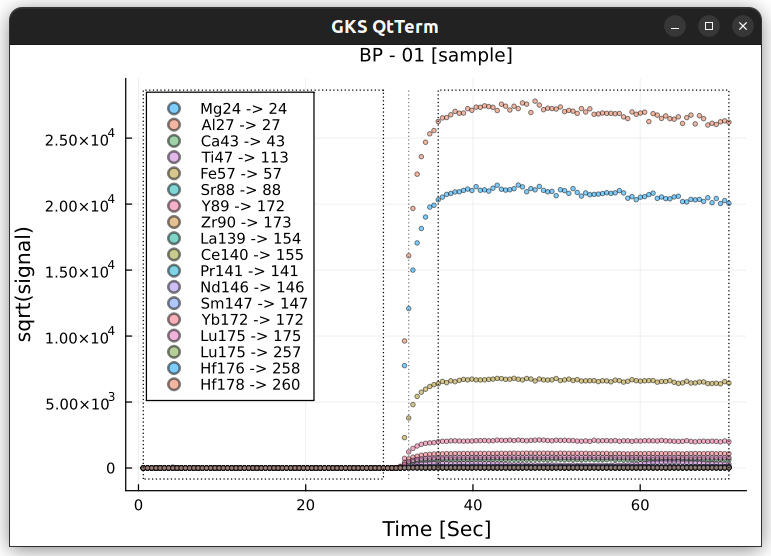
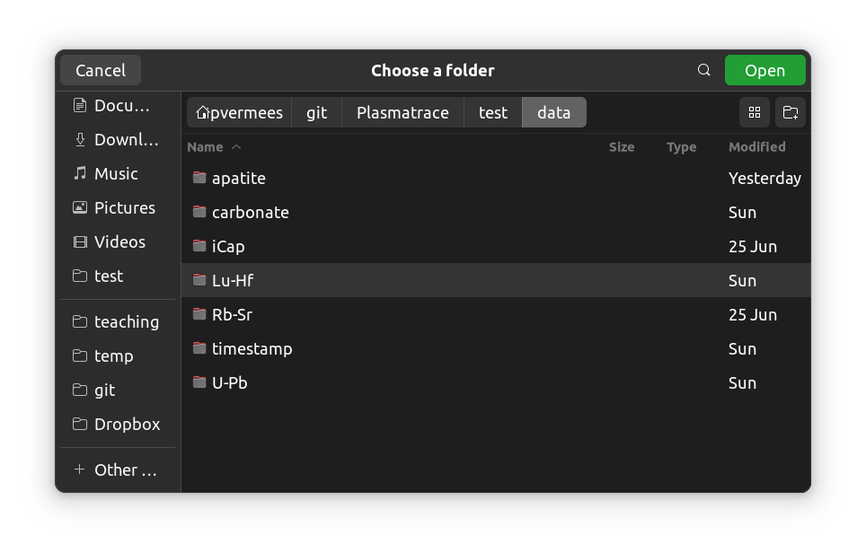

# Plasmatrace

## Julia package for LA-ICP-MS data reduction

Plasmatrace is in early development and has not yet been added to the
[Julia](https://julialang.org/) package repository. However, if you
want to play around with the current functionality, then you can
install the package from GitHub. First, make sure that you have Julia
installed on your system by downloading it from
[here](https://julialang.org/downloads/#current_stable_release). Then,
at the Julia REPL:

```
import Pkg; Pkg.add(url="https://github.com/pvermees/Plasmatrace.git")
```

There are four ways to interact with Plasmatrace:

1. [TUI](#tui-text-based-user-interface): an interactive text-based user interface
2. [TUI + GUI](#tui-+-gui-extension): a TUI augmented with graphical user interface elements
3. [REPL](#repl-command-line-interface): the command-line interface
4. [Hybrid](#tui-+-repl): combining the TUI, GUI and REPL

## TUI (text-based user interface)

Here is a short example of a menu-driven Plasmatrace session:

```
julia> using Plasmatrace
julia> PT()
-------------------
 Plasmatrace 0.6.5
-------------------

r: Read data files[*]
m: Specify the method[*]
t: Tabulate the samples
s: Mark mineral standards[*]
g: Mark reference glasses[*]
v: View and adjust each sample
p: Process the data[*]
e: Export the results
l: Logs and templates
o: Options
u: Update
c: Clear
x: Exit
?: Help
r

a: Agilent
t: ThermoFisher
x: Exit
?: Help
a

d: Read a directory of individual data files
p: Parse the data from a single file using a laser log
(? for help, x to exit):
d

Enter the full path of the data directory (? for help, x to exit):
data/Lu-Hf

r: Read data files
m: Specify the method[*]
t: Tabulate the samples
s: Mark mineral standards[*]
g: Mark reference glasses[*]
v: View and adjust each sample
p: Process the data[*]
e: Export the results
l: Logs and templates
o: Options
u: Update
c: Clear
x: Exit
?: Help
v
```



## TUI + GUI extension

You can augment the TUI with GUI elements (currently just file choosers) by installing the
`PTgui` extension (installable from [here](https://github.com/pvermees/PTgui)):

```
julia> using Plasmatrace, PTgui
julia> PT(PTgui)
-------------------
 Plasmatrace 0.6.5
-------------------

r: Read data files[*]
m: Specify the method[*]
t: Tabulate the samples
s: Mark mineral standards[*]
g: Mark reference glasses[*]
v: View and adjust each sample
p: Process the data[*]
e: Export the results
l: Logs and templates
o: Options
u: Update
c: Clear
x: Exit
?: Help
r

a: Agilent
t: ThermoFisher
x: Exit
?: Help
a

d: Read a directory of individual data files
p: Parse the data from a single file using a laser log
(? for help, x to exit):
d
```



## REPL (command-line interface)

Here is an example of a carbonate U-Pb data reduction using WC-1 for
time-dependent elemental fractionation correction between U and Pb and
NIST-612 for mass-dependent fractionation correction of the
Pb-isotopes. The script exports all the aliquots of the "Duff" sample
to a JSON file that can be opened in IsoplotR:

```
julia> method = "U-Pb"
julia> run = load("data/carbonate",instrument="Agilent")
julia> standards = Dict("WC1"=>"WC1")
julia> glass = Dict("NIST612"=>"NIST612")
julia> channels = Dict("d"=>"Pb207","D"=>"Pb206","P"=>"U238")
julia> blk, fit = process!(run,method,channels,standards,glass)
julia> export2IsoplotR(run,method,channels,fit,blk,prefix="Duff",fname="Duff.json")
```

## TUI + REPL

You can seamlessly switch from the TUI to the REPL and back. The following example runs a previous Plasmatrace session (`logs/test.log`) and stores the TUI settings into a variable called `ctrl`. Type `summarise(ctrl)` at the REPL to view the contents of this variable. You can manipulate the contents of `ctrl` and sync it with the TUI using the `setPTctrl()` function.

```
julia> PT(logbook="logs/test.log")
...
julia> ctrl = getPTctrl();
julia> plot(ctrl["run"][1])
```